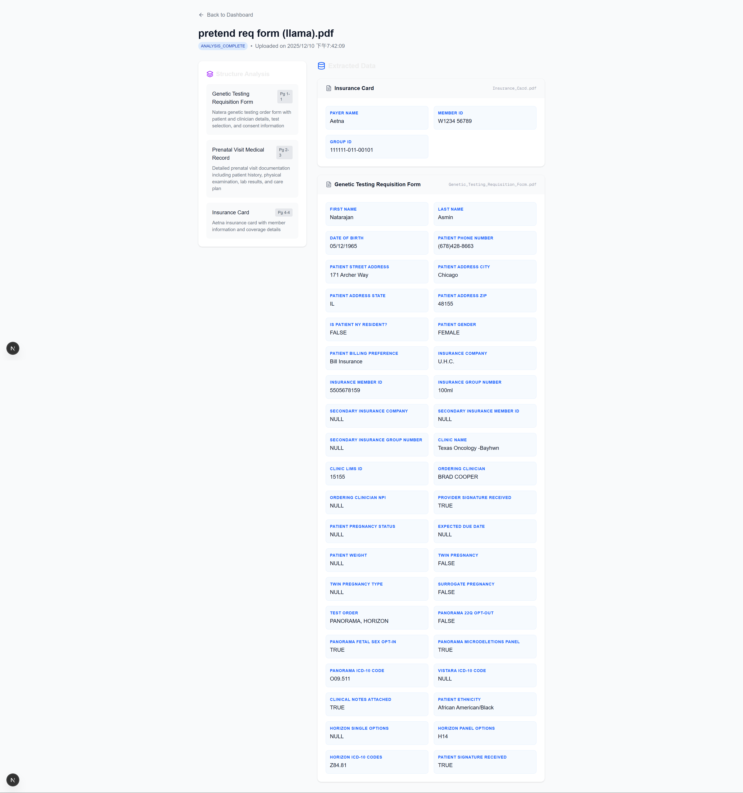
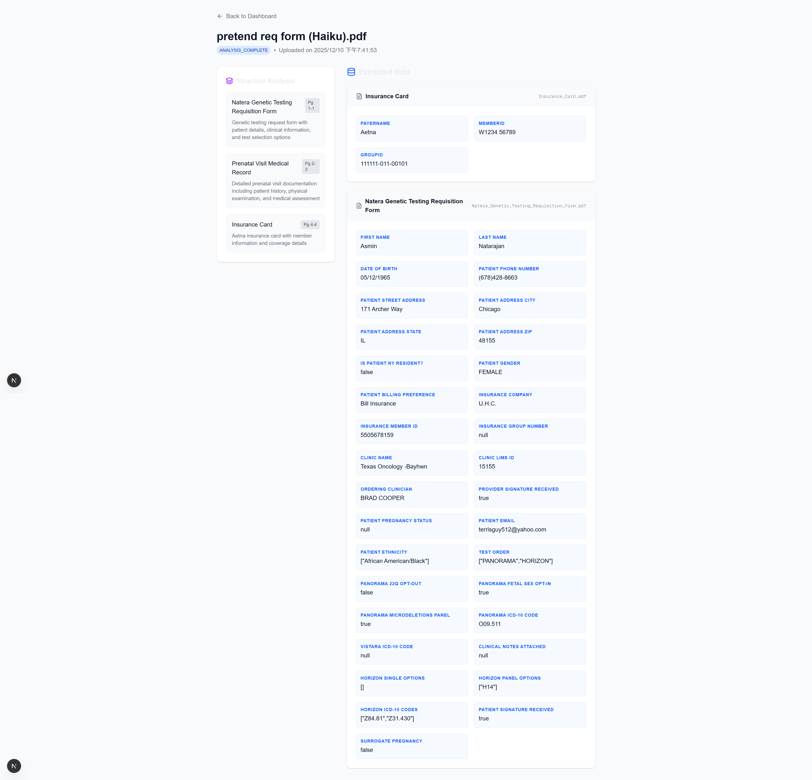

# AI Document Parser: Model Performance Report

## Overview
This project explores the performance of various AI models in parsing and extracting data from medical documents, specifically Requisition Forms and Insurance Cards. The goal was to identify the most effective model for handling different document types and qualities, including handwritten text and blurred scans.

## Methodology
We tested several Large Language Models (LLMs) integrated with OCR capabilities to parse sample documents. The models tested include:
- **Anthropic Claude 3 Haiku**
- **Meta Llama 3**
- **Anthropic Claude 3.5 Sonnet**
- **Cohere Command R+**
- **Mistral Large**
- **Amazon Titan**

## Key Findings
Following manual validation of the extracted data, we observed distinct strengths for different models:

*   **Claude 3 Haiku**: Demonstrated superior performance on **Insurance Cards**, particularly with low-quality inputs.
*   **Meta Llama 3**: Achieved the best results on **Testing Requisition Forms**, excelling at deciphering handwriting.

## Detailed Analysis

### Meta Llama 3 Performance
The Llama 3 model proved highly effective for handwritten content. It successfully extracted the majority of fields from the handwritten Requisition Form. However, its performance on the Insurance Card was limited, extracting only three columns.

### Claude 3 Haiku Performance
The Haiku model showed remarkable resilience with poor image quality. It successfully extracted most data columns from a blurred photo of an Insurance Card. Additionally, it maintained a strong performance on the Testing Requisition Form, making it a versatile contender.

## Other Models
We also evaluated **Claude 3.5 Sonnet**, **Cohere Command R+**, **Mistral Large**, and **Amazon Titan**. In this specific test suite, these models encountered difficulties and did not process the data as accurately as Haiku or Llama 3 for the selected samples.
