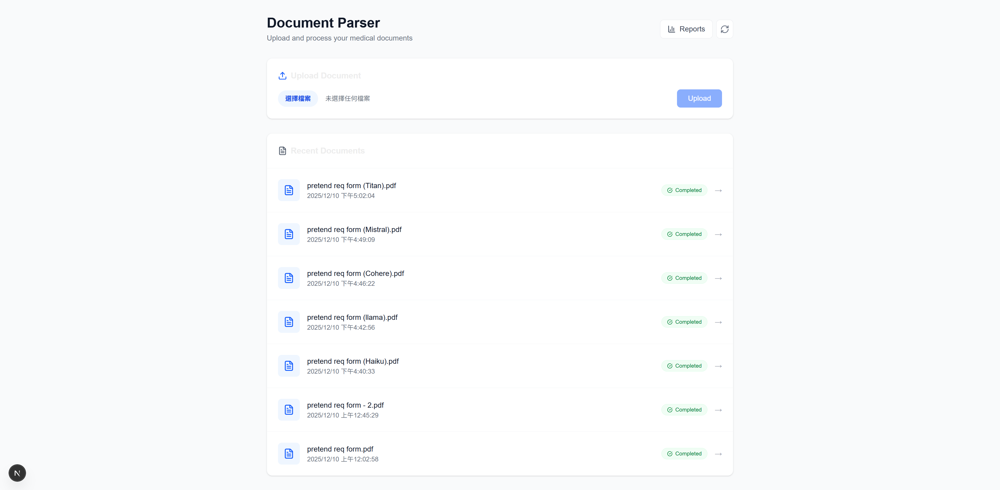

# AI Document Parser: Model Performance Report

## Overview
This project explores the performance of various AI models in parsing and extracting data from medical documents, specifically Requisition Forms and Insurance Cards. The goal was to identify the most effective model for handling different document types and qualities, including handwritten text and blurred scans.

## Methodology
We tested several Large Language Models (LLMs) integrated with OCR capabilities to parse sample documents. The models tested include:
- **Anthropic Claude 3 Haiku**
- **Meta Llama 3**
- **Anthropic Claude 3.5 Sonnet**
- **Cohere Command R+**
- **Mistral Large**
- **Amazon Titan**

## Key Findings
Following manual validation of the extracted data, we observed distinct strengths for different models:

*   **Claude 3 Haiku**: Demonstrated superior performance on **Requisition Forms** when provided with a field schema, significantly outperforming Llama 3 by extracting more valid fields (only 4 nulls vs 10 nulls).
*   **Insurance Card Analysis**: Both **Haiku** and **Llama 3** showed comparable performance, with both models successfully extracting only the three core identification fields (Payer Name, Member ID, Group ID).

## Detailed Analysis

### Meta Llama 3 Performance
On **Insurance Cards**, Llama 3 performed similarly to Haiku, successfully identifying only the three core fields: **Payer Name**, **Member ID**, and **Group ID**.

However, when analyzing the **Requisition Form** with the provided field schema, Llama 3 showed lower accuracy than Haiku, leaving approximately **10 fields as null**.

### Claude 3 Haiku Performance
Haiku demonstrated superior performance on the **Requisition Form** when guided by the known field definitions. It was highly accurate, failing to extract only **4 fields**.

On the **Insurance Card**, it matched Llama's performance, extracting the same three key fields.

## Other Models
We also evaluated **Claude 3.5 Sonnet**, **Cohere Command R+**, **Mistral Large**, and **Amazon Titan**. In this specific test suite, these models encountered difficulties and did not process the data as accurately as Haiku or Llama 3 for the selected samples.

## Project Implementation Summary
This project demonstrates a complete end-to-end serverless architecture for intelligent document processing:

1.  **Infrastructure**: Built entirely using **AWS CDK** for reproducible Infrastructure as Code (IaC).
2.  **Backend Workflow**: Implemented an event-driven pipeline using **S3**, **EventBridge**, and **Step Functions** to orchestrate document processing.
3.  **AI Integration**: Leveraged **AWS Textract** for raw OCR and **AWS Bedrock** to invoke various LLMs (Claude, Llama, Mistral) for intelligent data extraction and classification.
4.  **Frontend Application**: Developed a modern **Next.js** dashboard allowing users to upload files, view processing status, and analyze extraction results via a reporting interface.
5.  **Model Evaluation**: Incorporated a flexible mechanism to dynamically switch and test different LLMs to optimize for accuracy and cost.